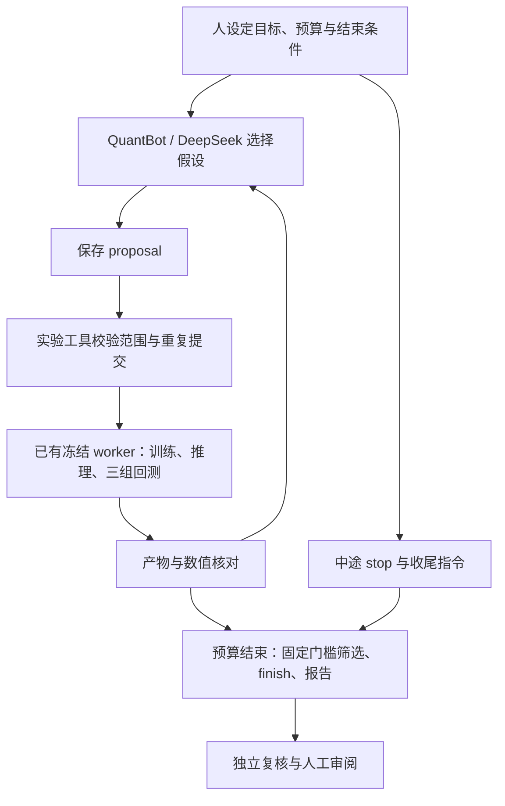

# DeepSeek / QuantBot 工作流真实验收

**目的：验证工作流是否真正可执行，不开展长期研究，不以找到盈利策略为验收条件。**

本次验证的问题：现有 QuantBot 能否在固定研究边界内，实际调用训练、推理和回测，根据前一轮数值结果提出下一轮实验，最后给出可审查的结论。不是只测试聊天、生成报告或预先排好参数的批量执行。

## 当前执行范围

- Agent：运行中的 QwenPaw 默认工作区，实际选择 `deepseek/deepseek-v4-flash`。
- 输入：复用 `results/frozen-controls-20260907-v3/` 的已冻结数据、训练代码和镜像；执行前后验证文件哈希。新实验重新训练、逐日推理并运行事件驱动回测，不用旧结果冒充。
- 实际实验：八因子 LightGBM 基线、Agent 根据反馈选择的三个候选、一个固定版本的双倍费用压力验证。用户澄清范围时已提交上述实验，随后禁止新增实验，只收尾现有任务。后续复用提示词和新建会话默认上限已收紧为两个候选。
- Agent 可选择的改动：已有因子子集，或受限范围内的树模型参数。尚未验收任意新因子代码生成、换模型家族、在线模拟盘和实盘交易。
- 训练 2023-01-03 至 2024-12-31；验证 2025-01-06 至 2025-03-31；开发比较 2025-04-07 至 2025-06-30。最后一段已参与研究，不能称为最终独立测试。
- 本轮目录：`data/agent_research/20260907-agent-loop/`。保留从 9 月 7 日开始的目录名，正式执行跨入 9 月 8 日。

## 实际发现的集成差异

### 无界面 CLI 能调用模型，但未装载执行工具

第一次真实调用 `qwenpaw task`，日志明确为 `model=deepseek/deepseek-v4-flash tools=0`。Agent 诚实返回无法读取研究配置，但 CLI 外层仍标记 `status=success`。

根因检查：当前安装版本的 `cli/task_cmd.py` 构造的上下文 `workspace=None`；`runtime/builder.py` 从工作区装载工具，缺少工作区时得到空工具列表。因此，这个版本不能用 CLI 返回 success 证明研究执行成功。未修改安装包或关闭工具保护。

证据：`data/agent_research/20260907-qwenpaw-smoke/result.json`。

### 正式控制台入口具有真实工具

仓库旧代理中的 `/api/agent/process` 在本机返回 HTTP 405。读取当前安装的 `app/routers/console.py` 后，确认入口为 `POST /api/console/chat`。从该入口调用，DeepSeek 成功执行 `read_file`，读取八因子配置，SSE 包含工具调用与输出。该入口也是本次完整实验使用的入口。

证据：会话目录下 `smoke-api/transport.json`（旧入口失败）、`smoke-console/events.sse`（新入口真实工具输出）。这次新增了可用的研究客户端，没有改动旧网关代理及线上服务。

## 代码与职责



循环中的下一候选由 DeepSeek 选择；训练、计算和门槛由确定性代码执行。图中的循环是有限轮次验收，达到结束条件后不再追加研究。

| 文件 | 职责 |
| --- | --- |
| `scripts/run_quantbot_session.py` | 调用正在运行的 QuantBot，保留实际 SSE 和传输结果；请求不自动重发 |
| `scripts/agent_research_tool.py` | 提供固定边界的实验提交、状态查询、核对和决策落盘；复用已有冻结 worker |
| `prompts/quant-research-session.md` | 给 Agent 的研究要求、工具说明、预算、人工介入和报告要求 |
| `scripts/verify_agent_research.py` | 独立从成交、持仓、净值 CSV 重算，并核对输入、配置、对照组和 Agent 记录 |
| `scripts/test_quantbot_session.py` | 检验工具事件去重、终态和模型用量摘要 |
| `scripts/test_agent_research_tool.py` | 检验越界配置、重复/不确定提交、特征消融口径和错误入选的拦截 |

研究路线由 Agent 决定；工具不生成下一候选。工具强制串行、新建会话最多两个候选（本次原始合同为三个）、四小时新实验提交窗口（保护上限，不要求运行四小时）；训练容器保持网络关闭、输入只读、4 CPU / 8 GB。每次 candidate 的 changes 都相对基线应用，而非隐式继承上一候选。

基线、候选和压力运行共用真实执行路径：训练 → 保存模型 → 每日独立推理 → 批量评分一致性核对 → 模型/动量/同池等权三组回测 → 逐笔现金和逐日资产核对。指数另作参考，不是三组策略中的等权组。

候选的开发筛选门槛在实验前固定：净收益改善至少 0.5 个百分点；最大回撤恶化不超过 1 个百分点；验证 Rank IC 为正；开发比较区间前后两个近似等长的交易日分段（28/29 日，边界日不遗漏），相对基线均不低于 -0.5 个百分点。这是本次工程验收的筛选规则，不是统计显著性证明。压力验证后禁止增加候选。

## 重复运行

先确保前述冻结输入存在并通过原始冻结研究验收，然后创建**新目录**：

```bash
python3 scripts/agent_research_tool.py init \
  --session data/agent_research/my-new-session \
  --frozen results/frozen-controls-20260907-v3
```

复制本次提示词并把其中所有会话路径替换为新目录在 QwenPaw 中的 `/data/agent_research/my-new-session`，再运行：

```bash
docker exec qwenpaw python /quantmind/scripts/run_quantbot_session.py \
  --instruction /data/agent_research/my-new-session/instruction.md \
  --output /data/agent_research/my-new-session/agent-run-01 \
  --session research-my-new-session --timeout 14400
```

API 使用 QwenPaw 已配置的工作区模型，不在脚本、命令或记录中传入 API 密钥。本地控制台如果启用认证，需要通过既有认证方式接入，不能关闭认证解决。

用户要中途收尾时，调用 `POST /api/console/chat/stop?chat_id=<session_id>`，确认停止结果后向同一会话发送仅收尾提示词，输出到新 `agent-run-*` 目录。该停止接口会停止 Agent 当前轮次，已提交的独立 Docker 计算仍需查询完成或另行取消。本轮实测 `stopped=true`；连被中断的 SSE 都可能返回 `response.status=completed`，必须同时核对工具输出、决策和报告。

传输断开不代表服务端任务停止；不要盲目重发。先查看会话和实验 `state.json`，确认没有仍在运行的任务。一次 Docker 提交如果结果不确定，会保留 submission intent 并拒绝下一实验，不自动重试。

```bash
python3 -m unittest discover -s scripts -p test_agent_research_tool.py
python3 -m unittest discover -s scripts -p test_quantbot_session.py
python3 scripts/verify_agent_research.py --session data/agent_research/20260907-agent-loop
```

## 实验结果

**验收结论：受控范围内的 Agent 自主选择 → 实验 → 读取结果 → 调整下一步 → 决策与报告闭环已真实跑通。** 原有基架提供模型、上下文、工具与执行能力；本次补充研究合同、实验接口、日志客户端和独立核对脚本。不能把它描述为原装即用的完整研究产品，也不能据此宣称具有开放式自主研究能力。

正式 Agent 两轮调用合计约 20 分钟墙钟时间（00:00:58 至 00:21:05，包含用户介入间隔；不含此前排查与代码准备）。5 个实验均完成真实训练、57 日独立推理（每轮 5,700 条评分）及三组回测。首次基线的模型、评分、逐日重放和股票池与旧冻结运行逐字节一致；本次仍重新执行了计算。

| 实验 | Agent 选择的变更 | 开发净收益 | 最大回撤 | 成交笔数 | 候选门槛 |
| --- | --- | ---: | ---: | ---: | --- |
| E00 | 原始八因子基线 | 13.7316% | -3.1643% | 524 | 基线 |
| E01 | 去掉 mom_ret_1d、turn_1 | 14.3029% | -2.6100% | 400 | 四项通过 |
| E02 | 原八因子，min_data_in_leaf=500 | 12.3948% | -2.9349% | 526 | 收益、半段门槛未过 |
| E03 | 原八因子，learning_rate=0.02 | 12.1383% | -3.2222% | 518 | 收益、半段门槛未过 |
| E04 | E01 的六项费用参数翻倍 | 13.1968% | -2.8909% | 400 | 成本敏感性记录，不参与候选门槛 |

数值仅用于证明流程确实执行。E02/E03 没有改善不影响工作流验收；不为追求收益继续增加尝试。

### 验收项与证据

| 验收项 | 实际结果 | 证据（相对本轮目录） |
| --- | --- | --- |
| 真正调用 DeepSeek 与工具 | 第一轮 43 个工具调用记录、42 个完成输出，停止时有一个查询未返回；收尾轮 8 个调用、8 个完成输出 | `agent-run-01/events.sse`、`agent-run-02/events.sse` |
| 前轮结果影响下一步 | E00 的半段收益、模型特征增益促使 E01 消融；E01 成交/费用变化促使 E02 测参数平滑；E02 未改善后 E03 换学习率假设。候选不是工具预置 | `experiments/E01..E03/proposal.json`、`research-log.md` |
| 真实计算与可比性 | 5 次真实训练与回测；候选股票池、动量与同池等权对照逐字节一致；压力轮模型及评分与 E01 一致，只修改固定费用 | `verification.json`、各实验 `config.json`/产物哈希 |
| 独立账务核对 | 15 组组合核对通过；最大逐笔现金误差 0，最大逐日资产误差约 9.31e-9 元；费用与净收益/回撤可独立重算 | `verification.json`、各实验成交/持仓/净值 CSV |
| 用户介入与收尾 | stop 返回 true；同一会话接收收尾指令；没有新增实验；已有 E04 完成后 finish，最终保留 E01 作为本轮开发候选 | `scope-correction.json`、`closeout-instruction.md`、`decision.json` |
| 报告质量 | 数值可核对，但原稿包含错误比较与过强机制断言；外部复核已修订报告，原稿与原始决策完整保留 | `REPORT.agent-original.md`、`REPORT.md`，见下文 |

新增工具的 5 项边界测试、客户端的 2 项事件测试通过。`verify_agent_research.py` 对实际产物独立验证通过，输出 `verification_passed=true`；研究状态仍为 `needs_independent_validation`，`automatic_trading_authorized=false`。没有注册线上模型或下单。

### 人工审阅发现的缺口

Agent 原稿误写“双倍成本下 13.20% 仍优于 E00 基线”，实际 E00 为 13.73%，应为低约 0.53 个百分点；不能只信最终文字报告。它还把两次参数尝试不改善上升为“证伪过拟合机制”“早停是真实信号”，这些实验只支持对应配置未达到预期，不能证明原因。原始 `decision.json` 也含类似机制解读，程序门槛通过仅保证固定数值条件，不代表文字推理通过审查。修订版报告保留明确复核标记。

期间 Agent 曾遇到 QwenPaw 缺少 pandas/pyarrow，自行改用标准库 CSV 和模型文本继续；没有安装依赖。它最初也误解过半段收益口径；因此半段计算与入选规则由工具固定，而不能交给自由文本计算。这是本次需要增加工具代码的实际理由。

### 用量与留档

收尾轮服务端报告 `deepseek-v4-flash`：输入 791,801 tokens、输出 7,752、合计 799,553，其中缓存读取 786,560。该数字是收尾轮服务端回传值，不能当作完整本次用量或账单：第一轮被 stop 中断，未返回 `turn_usage`；此前 smoke 另有调用。原始 SSE、提示词和返回记录均保留本地，未把凭证写入文档。

## 保留的科学与工程限制

- 冻结与现金核对不能证明原始因子的历史可得性，也不能解决历史退市/ST/涨跌停规则及已有成交报价回退的限制。
- 验证集参与早停与模型选择；开发比较区间被反复用于探索，本轮不能声称独立样本外收益。
- Agent 的文字结论必须与数值产物复核；HTTP 成功、模型完成回答和研究完成是不同状态。
- 原有 QuantBot 工具权限仍然较广。实验 API 的边界可强制约束经该工具的实验，提示词对其他工具的限制不等于系统级权限隔离。
- 原始大型输入、模型与完整过程留在本地忽略目录；文档、工具代码和提示词可纳入版本管理。
