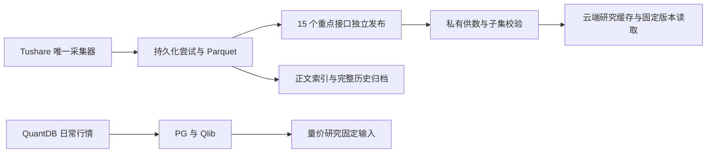

# 研究先行的数据优先级

首个交付是 A 股日频量价研究所需的固定输入；第二层再接行业相对强弱信号。总历史任务清零、正文解析完成和全品种覆盖均不是开始研究的前置条件。

| 层级 | 数据与用途 | 验收条件 |
| --- | --- | --- |
| P0 | 股票日线、复权、交易日历、基准指数，及研究选用的量价因子；停复牌、涨跌停用于可交易性约束 | 明确来源和复权口径；覆盖研究区间；缺口逐项列出；Parquet、Qlib 与应用日期一致；固定输入有校验清单 |
| P1 | 行业指数和历史成分、ETF 日线与复权；财务数据按具体课题选取 | 行业信号可单独验证；成分与财务必须核实生效/公告时间，未核实不得称为可交易组合或 PIT 因子 |
| P2 | 全市场远期历史、非当前课题的跨资产数据、公告附件和全文 | 后台继续补采，不阻塞 P0/P1 交付；保留原始对象、失败记录及全部检查点 |

## 已有调度如何落实

`config/tushare-research-priority.json` 是覆盖项，不是全量配置。应用时保留其余字段，并合并 `group_weights`，不得用此文件直接替换 `pipeline-config.json`。

- 结构化最近七天的六个按日接口每次规划最多直接准入 42 个请求，独立于名称变更等长游标。只准入已选择且通过家族校验的 API，不重置历史游标。按自然日请求并保留空结果，不依赖尚不完整的日历删日期。
- 复用已有快速通道，每两次调度有一次优先尝试核心行情 API；既有账号/API 速率门禁继续生效。快速通道内仍保留近期/历史轮转，比例不是固定吞吐保证。
- RRG 与 structured 家族权重设为 10，market 为 4，其他家族保留原权重。`daily` 的现行速率策略仍标为待复核，不能强塞进要求已审核的快速通道；它通过 structured 高权重和近期优先队列推进。
- 正文每轮最多 300 个处理阶段，时间预算 30 秒，4 个下载线程、1 个解析进程；原预算为 2500/100 秒/12/4。时间预算在处理阶段之间检查，在途阶段自然结束可能超过预算，不能理解为 30 秒硬超时。处理阶段数不是独立文档数。正文历史与失败记录不删除。
- 文档 claim schema 7 添加 `document_attempts(document_id)` 索引，终态重试的单文档计数不再全表扫描；不改写尝试历史。

## 数据通道和固定输入

云端默认研究子集增补 `stk_limit`、`suspend_d`、`moneyflow`，共 15 个 API，仍受原有 50 GiB 上限和 100 GiB 云端空间保留限制。Tushare 的已验证发布经 Mac 私有供数入口到云端研究子集；采集成功不代表已经发布，也不自动替换已有课题的固定 release。QuantDB 日常行情是现有量价研究的可用主通道，应独立验收 PG、Qlib 和页面派生结果。

扩大接口集合时可复用范围更窄的已验证子集。先验证缓存清单本身及接口范围，再确认旧分区全部保留、文件描述与新发布逐项一致；不满足条件时回退完整检查。新增文件仍校验内容哈希和 observation 引用。启动参数中已有显式 `--apis` 的供数服务也需更新实际参数，仅修改默认值不会生效。

研究数据交付至少记录：节点、原始数据版本/日期、代码提交、实际读取列和行数、缺口、输入 manifest 校验。先准备并验证数据输入；创建课题、训练或宣布独立验证通过另按研究方案执行。旧课题及其输入保持原样。

## 结构化研究数据独立发布

配置覆盖中的 `research_publish_interval_seconds: 900` 为上述 15 个接口启用独立发布。默认关闭，要求已有 `publish_interval_seconds` 大于零。原生 worker 每个周期先检查研究发布，成功后使用单独周期继续采集或完整发布；15 分钟是成功检查后的调度间隔，不是数据延迟承诺。

发布复用原有尝试清单、质量重评、归一化恢复、历史归档分区和内容哈希版本，写入 `RESEARCH_CURRENT.json`。它不取得正文锁、不构建正文索引，也不包含正文和全量历史 manifest。研究源选择仅在请求接口全部被该指针覆盖时使用它；其他接口及旧部署继续走 `CURRENT.json`。子集准备和云端下载仍逐项校验新文件的 SHA、大小及 observation 引用，失败保留已验证版本。研究发布与完整发布分别记录状态和耗时；完整发布失败或正文锁繁忙时，研究模式继续采集并报告 `partial` 或明确延迟状态。

研究 manifest 的 `history_complete`、`historical_versions_complete` 均为 false；子集保留来源 release 和重点接口的缺口。独立发布不能证明历史完整、PIT 正确、ETF 可执行或研究收益有效。既有课题的固定版本不会自动换新。

仍有一个运行边界：两类发布复用单一采集 writer 和 `pipeline.lock`，完整发布运行期间仍暂停新一轮采集和研究发布。独立通道先交付已完成的结构化数据，消除了正文索引作为每次研究交付前置条件的限制，并未增加并发采集器。版本与缓存仍受原有空间保留/预算控制，不自动删除固定研究输入。

## 发布与恢复

先验证独立 worktree；合入后核对两端源码。原生采集升级时保存 ENABLED 和原配置，移开 ENABLED，等待当前采集及正文任务自然结束后停止唯一采集 worker。通过现有安装入口更新 runtime，原子写入合并后的配置，再恢复 worker 与 ENABLED。供数、云端缓存和 QuantDB 更新不随之停机。

配置回退只恢复保存的旧配置；索引升级是兼容的派生结构，不删除文档记录。旧 runtime 不支持 claim schema 7，因此代码回退应保留新版文档模块，或在排空窗口使用单独审核的降版迁移。

停用独立发布时，先在排空窗口把研究发布间隔恢复为 0，并保存、移开 `RESEARCH_CURRENT.json`；供数随即回落到 `CURRENT.json`。仅关闭发布周期却留下指针，会继续提供最后一个研究版本。不得删除该版本的 manifest 或固定课题仍在引用的文件。
